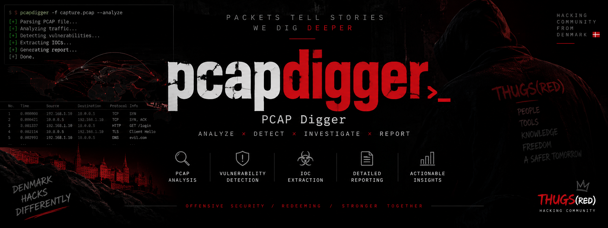

<p align="center">
  
</p>

<h1 align="center">pcapdigger</h1>

<p align="center">
  <em>LOAD A PCAP. GET THREE REPORTS.</em><br>
  <em>A single-binary CLI that digs through a packet capture and writes a network-engineering,
  security-architect, and executive report — with GeoIP/ASN/WHOIS enrichment and an SVG flow
  diagram — from one pass over the file.</em><br>
  <a href="https://thugs.red/projects/pcapdigger"><strong>thugs.red/projects/pcapdigger</strong></a>
</p>

<p align="center">
  
  
  
  
  
  
  
</p>

---

Point `pcapdigger` at a `.pcap`/`.pcapng` file and it does the rest in a single streaming pass:
rebuilds every host and conversation, runs a broad battery of security heuristics (port/host
scans, ARP spoofing, cleartext credentials, weak/legacy TLS, DNS tunneling and NXDOMAIN floods,
data-exfiltration and beaconing patterns, stealth-scan flag combinations, exposed/backdoor ports,
and IOC matching), enriches every host with offline GeoIP/ASN and live WHOIS lookups, and writes
three differently-framed reports — one for the network engineer, one for the security architect,
one for the executive who just wants the risk rating — in whichever of JSON, CSV, or Markdown you
ask for, plus a hand-drawn SVG diagram of who talked to whom.

There is no libpcap, no cgo, and nothing runs on the network on its own: pcap/pcapng parsing is
pure Go, and the only command that ever reaches out to the internet is `pcapdigger update-db`,
which you run explicitly to fetch MaxMind's GeoLite2 databases. Every file pcapdigger writes on
its own — config, the GeoIP databases, the WHOIS cache — lives under `~/.config/pcapdigger`.

<p align="center">
  <code>pcapdigger analyze capture.pcap</code> &nbsp;|&nbsp;
  <code>pcapdigger analyze capture.pcap --report security --format markdown</code>
</p>

## What's in the box

| | |
|---|---|
| **Capture parsing** | `pcapgo` (pure Go) reads both classic `.pcap` and `.pcapng`, no live capture, no libpcap. Ethernet/ARP/IPv4/IPv6/TCP/UDP/ICMP, with best-effort DNS, HTTP, and TLS ClientHello/Certificate parsing layered on top. |
| **Host & flow inventory** | one pass builds a host table (MACs, hostnames from DNS/SNI/HTTP Host, byte/packet counters, ports contacted) and a bidirectional conversation table (protocol, app-protocol guess, TCP flags, TLS version/SNI/cipher, byte/packet counts). |
| **Security detectors** | port & host scans (vertical/horizontal/ICMP sweep), ARP spoofing (conflicting IP↔MAC, gratuitous-ARP bursts), plaintext credentials (HTTP Basic-Auth, FTP/Telnet/POP3/IMAP, HTTP form fields), weak/legacy TLS (SSLv3–1.1, weak ciphers, expired/self-signed/mismatched certs), DNS anomalies (high-entropy tunneling-style labels, NXDOMAIN floods), data exfiltration (asymmetric outbound transfers, oversized DNS/ICMP payloads), C2-style beaconing (periodicity analysis), stealth scans (NULL/FIN/XMAS flag combinations), known-risky/backdoor ports, and an optional IOC blocklist match. |
| **Enrichment** | GeoIP + ASN from local MaxMind GeoLite2 `.mmdb` files (`pcapdigger update-db`, fully offline afterward) and live WHOIS (raw TCP/43, IANA→RIR referral chasing, no API key, cached and capped to the busiest external hosts). |
| **TLS decryption** | best-effort, and only ever from a secret *you* supply in `~/.config/pcapdigger/tls`: an NSS `SSLKEYLOGFILE`-format keylog (TLS 1.2 or 1.3, any cipher), a static RSA private key (legacy TLS 1.2 RSA key exchange), or a PSK identity/key file (TLS 1.2 PSK suites). Decrypted application data is fed straight back through the same HTTP/credential scanners as cleartext traffic. No key exchange is ever attacked or guessed. |
| **Reports** | three personas from one shared data model — **network engineering** (full protocol/host/flow/DNS/TLS tables), **security architect** (findings by severity with evidence and recommendations), **executive** (composite risk rating, plain-language highlights, top issues) — each in JSON, CSV, and/or Markdown. |
| **Flow diagram** | a hand-built SVG: internal hosts in one column, external in the other, busiest conversations drawn as cubic-Bézier splines sized by bytes transferred, flows tied to a finding drawn red/dashed. |
| **Config & data** | everything pcapdigger reads or writes on its own lives under `~/.config/pcapdigger` — `config.yaml`, the GeoIP `.mmdb` files, and the WHOIS cache. |
| **Under it** | **Go 1.27+**, `CGO_ENABLED=0`, one static binary, `spf13/cobra` CLI. |

## Quick start

```bash
git clone https://github.com/kawaiipantsu/pcapdigger.git && cd pcapdigger
make build

./dist/pcapdigger analyze capture.pcap                       # all three reports, all three formats
./dist/pcapdigger analyze capture.pcap -o ./report            # choose the output directory
./dist/pcapdigger analyze capture.pcap --report security --format markdown
./dist/pcapdigger analyze capture.pcap --ioc-file iocs.txt    # match against your own blocklist
```

### Enabling GeoIP/ASN enrichment

WHOIS works out of the box (no key needed). GeoIP/ASN needs a free
[MaxMind](https://www.maxmind.com/en/geolite2/signup) account:

```bash
pcapdigger config set maxmind.account_id "<your account id>"
pcapdigger config set maxmind.license_key "<your license key>"
pcapdigger update-db          # downloads GeoLite2-City + GeoLite2-ASN into ~/.config/pcapdigger/data
```

From then on, every `analyze` run enriches hosts with country/city/ASN entirely offline. Skip all
of it with `--no-enrich`, or just WHOIS with `--no-whois`.

### Decrypting TLS traffic

Drop any of the following into `~/.config/pcapdigger/tls` and `analyze` picks them up
automatically — no flag needed (use `--no-decrypt` to opt out):

```bash
# Most common: capture a keylog alongside the traffic (works for both TLS 1.2 and 1.3,
# any cipher suite, no matter how the key was exchanged — this is what curl/browsers/
# most TLS libraries write when SSLKEYLOGFILE is set).
SSLKEYLOGFILE=~/.config/pcapdigger/tls/session.log curl https://example.com

# Or, for legacy TLS 1.2 RSA key exchange with no keylog available, the server's own
# static private key is enough:
cp server.key ~/.config/pcapdigger/tls/

# Or, for TLS 1.2 PSK-family suites, an "identity:hex-key" file (one per line):
echo "Client_identity:1a2b3c4d5e6f" > ~/.config/pcapdigger/tls/session.psk
```

Any flow found using a resolvable secret gets its actual application data recovered and
scanned like plaintext traffic (so HTTP-over-TLS credentials get caught too), and is marked
`tls_decrypted`/`tls_key_source` in the network report.

### Packages

```bash
make build-all          # linux amd64/arm64/386/armhf -> dist/pcapdigger_<version>_linux_<arch>
make checksums          # dist/SHA256SUMS
make deb                # .deb for each arch (via nfpm) -> dist/pcapdigger_<version>_<arch>.deb

sudo make install                                   # /usr/local/bin/pcapdigger
sudo dpkg -i dist/pcapdigger_*_amd64.deb             # or the Debian way
```

## How it works

A `pcapdata.Reader` streams decoded packets from the capture; `flow.Builder` folds them into a
host table and a bidirectional flow table in a single pass, alongside a few lightweight side
signals (ARP events, DNS query/response pairs, recovered plaintext credentials, malformed-packet
events) that the detectors need. Any TCP flow whose first payload byte looks like a TLS
ClientHello gets reassembled into an ordered byte stream per direction and handed to a
`tlssession.Session`, which resolves keys (`tlskeys`) from a keylog/RSA-key/PSK match and
decrypts with `tlscrypto` (TLS 1.2 PRF/AEAD/CBC+HMAC, including Extended Master Secret and
Encrypt-then-MAC, and TLS 1.3 HKDF/AEAD) whenever a matching secret is found; recovered
plaintext rejoins the normal HTTP/credential scanning path. `analyze` derives summary statistics from that table;
`security.Run` executes every detector over it to produce a severity-ranked finding list;
`enrich` fills in GeoIP/ASN (offline mmdb) and WHOIS (capped, cached) for the host table. All of
that is assembled into one `report/model.Report`, which `diagram` turns into the SVG and which
each of `report/{json,csv,markdown}` renders into the network/security/executive view the caller
asked for.

## Layout

```
cmd/pcapdigger/        CLI entry point and subcommands (cobra)
internal/
  config/               ~/.config/pcapdigger paths, config.yaml load/save
  pcapdata/             pure-Go pcap/pcapng reader
  proto/                DNS/HTTP/TLS ClientHello & certificate parsers, entropy helper
  flow/                 host inventory + conversation table builder (the single packet pass)
  analyze/              protocol mix, top talkers/ports, timeline, DNS/TLS summaries
  security/             Detector interface + the built-in detector battery
  enrich/
    geoip/              GeoLite2 mmdb lookups
    whois/              raw WHOIS client + on-disk cache
    updatedb/           GeoLite2 database download/install
  tlskeys/              loads ~/.config/pcapdigger/tls (keylog/RSA key/PSK files)
  tlscrypto/            TLS 1.2/1.3 key derivation + record decryption primitives
  tlssession/           per-connection TLS handshake/record state machine
  report/
    model/              the shared Report struct + the 3 persona views
    json/ csv/ markdown/ one renderer package per output format
  diagram/              SVG flow-diagram generator
packaging/debian/       nfpm template used by `make deb`
testdata/                a hand-crafted sample capture, plus real TLS fixtures (tls/)
```

## License

MIT — see [LICENSE](LICENSE).
